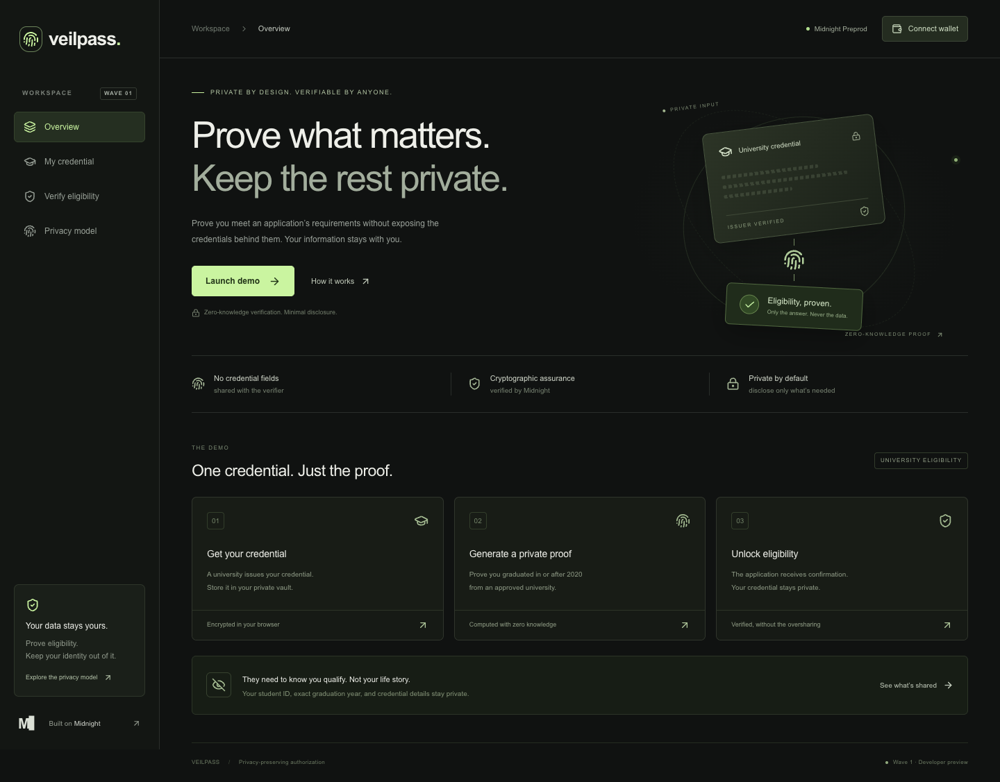

# VeilPass

**Prove what matters. Keep the rest private.**

A Midnight-native prototype for privacy-preserving credential authorization. A holder proves they hold a university credential from an approved issuer with a graduation year of 2020 or later. Compact enforces authenticity and eligibility; public state records an application-scoped nullifier instead of credential attributes.



## Status

Working and tested: Compact compilation and key generation, local Midnight deployment, proof-backed authorization, rejection of ineligible credentials and replays, encrypted browser storage, wallet connector integration, and the frontend. Evidence from local runs is in [`docs/evidence/local-e2e.json`](docs/evidence/local-e2e.json).

There's no public Preprod deployment. Local test chains are ephemeral, so their transaction IDs don't resolve on an explorer. [`docs/acceptance.md`](docs/acceptance.md) tracks what's verified against what isn't.

## Problem

Applications collect whole credentials to answer narrow eligibility questions. VeilPass answers the question privately and publishes only what the application needs to act on.

## Why Midnight

The `authorize` circuit takes private witnesses, verifies a salted credential commitment against the issuer batch root, checks the graduation policy, and inserts a nullifier into public state. The frontend uses Midnight.js to build, prove, balance, submit and confirm real transactions.

Running the generated JavaScript is useful in tests, but it isn't a ZK proof and isn't presented as one.

## Architecture

```text
Demo issuer (.private/issuer-batch.json)
    ├─ sample credential + membership path → holder's encrypted vault
    └─ root + approved issuer + app scope   → Compact constructor

Holder vault → private witnesses → local proof server → wallet → Midnight
                                                            └─ public nullifier
```

[`docs/architecture.md`](docs/architecture.md) covers the components. There's no policy engine, issuer registry or revocation service.

## Privacy model

| Information | Private / public |
|---|---|
| Student ID and subject | Private: issuer, holder, local prover |
| Graduation year and degree | Private: issuer, holder, local prover |
| Credential contents and secret | Private: issuer, holder, local prover |
| Eligibility result | Public |
| Policy and approved issuer | Public |
| Batch root and application scope | Public |
| Authorization nullifier | Public |

The local prover sees witness material — "local" is a trust boundary, not a cryptographic guarantee. The issuer knows both demo samples, and browser code can read an unlocked credential. [`docs/privacy-model.md`](docs/privacy-model.md) has the details.

## Credential lifecycle

`issuer:setup` generates two bearer credentials with independent 256-bit secrets and commits every field. It won't overwrite an existing batch. The issuer initializes the contract with the resulting root.

The browser fetches one sample over a same-origin POST and encrypts it with AES-256-GCM under a PBKDF2 key derived locally. The passphrase never goes to the server. Locking drops the credential from React state.

## Verification lifecycle

1. Connect a Midnight connector v4 wallet on the configured network.
2. Load and unlock a credential.
3. Check the on-chain root and application scope match it.
4. Run the witnesses and constraints, then request a proof from the local prover.
5. Have the wallet balance and sign, then submit.
6. Wait for indexer confirmation and verify the authorization landed in public state.

UI stages follow provider calls rather than timers. Errors never render as success, and SDK exception payloads aren't displayed or logged.

## Contract

Source: [`contracts/veilpass/veilpass.compact`](contracts/veilpass/veilpass.compact).

The batch root, approved issuer and application scope are immutable. Two-leaf Merkle membership runs privately, so individual commitments and path direction stay hidden. All credential fields bind to one persistent hash. Schema, issuer equality and `graduationYear >= 2020` are constrained in-circuit. The nullifier is domain-separated per application, and duplicates are rejected.

Public state holds only the root, issuer, application ID and authorization set.

The deployer is trusted — there's no root-update circuit. Verifiers must pin the correct contract address; a contract deployed by a holder isn't a trusted issuer deployment.

## Running locally

Needs Node 22.22.0+, npm and `unzip`. Docker for real proofs and network tests, Chrome for browser checks. macOS and Linux only; use WSL on Windows.

```bash
nvm use
npm ci
npm run toolchain:install
npm run contract:compile
npm run issuer:setup
npm test
npm run dev
```

Then open http://127.0.0.1:3000. Credential and vault flows work right away; network verification needs either the E2E command below or your own wallet and deployment.

The compiler download is checked against a pinned SHA-256. The first compile or prover start may fetch public parameters. `.toolchain`, generated proof assets and `.private` are gitignored — don't commit the issuer batch or wallet material.

### Pinned versions

| Component | Version |
|---|---|
| Compact compiler | 0.31.1 |
| Compact language | 0.23 |
| Compact runtime | 0.16.0 |
| Compact JS | 2.5.1 |
| Midnight.js | 4.1.1 |
| Ledger v8 | 8.1.0 (npm override) |
| DApp connector | 4.0.1 |
| Proof server | 8.1.0 |
| Local node | 1.0.2 |
| Local indexer | 4.3.3-hotfix |
| Next.js | 15.5.25 |

Two ledger WASM instances are incompatible, so keep the override and install with `npm ci`. Sources are in [`docs/midnight-research.md`](docs/midnight-research.md).

## Testing

```bash
npm run contract:check                    # generated execution, no keys
npm test                                  # contract constraints and state privacy
npm run typecheck
npm run build
npm run test:ui                           # dev server on :3000, needs Chrome
npm run test:e2e                          # local chain, funded wallet, real proof
VEILPASS_BROWSER_E2E=1 npm run test:e2e   # same, plus the browser connector flow
```

Run `contract:compile` before proving.

`test:e2e` spins up its own Docker chain, deploys, runs the valid and invalid cases, checks public state, writes evidence, then tears the chain down. It spends no real funds. The browser variant drives a real local funded wallet through the official adapter — proofs and confirmations aren't mocked.

`test:ui` covers encryption, unlocking, the no-wallet state and responsive layout without pretending to authorize. Network tests take minutes; proving is CPU-heavy.

## Deployment

For a Preprod session:

1. Copy `.env.example` to `apps/web/.env.local`, keeping `NEXT_PUBLIC_NETWORK=preprod`.
2. Run `npm run proof-server` (loopback :6300), then `npm run dev`.
3. Fund a Preprod wallet from the [faucet](https://midnight-tmnight-preprod.nethermind.dev/) and wait for spendable DUST.
4. Get a demo credential, connect the wallet, then deploy the batch from **Verify eligibility → Developer setup**.
5. Put the returned address in `NEXT_PUBLIC_CONTRACT_ADDRESS` and restart. Verifiers trust this deployment, not an address a holder hands them.
6. Generate a proof. Success includes the confirmed transaction ID.

No wallet, credentials or funds are embedded in the repo. The local E2E test is a reproducible deployment to a real local environment — it isn't evidence of a public one.

## Security and trust

Trusted: the demo issuer and deployer, Midnight's cryptography, the compiled contract, the holder's device and frontend, and the local prover. A compromised frontend can steal unlocked witness data, but it can't make the pinned contract accept altered fields without breaking the hash assumptions.

The ledger and verifier never receive credential attributes. In this demo the issuer also hosts the web app and already knows both samples, so it doesn't demonstrate issuer/verifier separation.

## Limitations

- Two shared bearer credentials, not per-user ones. No identity validation, no non-transferability.
- One successful authorization per credential and application scope. Repeating the demo needs a fresh deployment.
- The batch is two known records, which is not a meaningful anonymity set.
- Transaction timing, wallet metadata and nullifiers stay observable.
- No revocation, expiry, recovery, session tokens or audit.
- Browser extension interop and Preprod deployment still need validation against an installed wallet.

## Roadmap

Wave 1 delivers the primitive and documents its limits. Public Preprod deployment and an external-wallet walkthrough are operator tasks needing a funded wallet.

**Wave 2** — issuer registry, revocation, more schemas, reusable policies, holder-bound credentials.

**Wave 3** — policy composition, cross-application use, developer integrations, production hardening.
