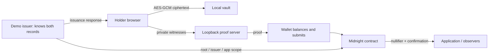

# Privacy model

## Data flow

## Who knows what

| Party | Knowledge |
|---|---|
| Issuer | Every field, the secret, both commitments and the batch mapping |
| Holder | Their credential, secret, sibling path, root and app scope |
| Frontend | Plaintext while unlocked, and can exfiltrate it if compromised |
| Local prover | The witness material needed to prove |
| Wallet | The proven transaction and fee metadata, not the issuer payload |
| Verifier | Issuer, policy, root, scope, accepted nullifier, transaction metadata |
| Observer | Public chain data, timing, and whatever correlates with it |

## Storage and transmission

Issuer files sit under `.private/` with restrictive permissions and are gitignored. Delivery is a same-origin POST returning the sample with `Cache-Control: no-store`. Credentials never appear in URLs. Development binds to loopback; anything non-local needs HTTPS.

The vault is encrypted in localStorage and the passphrase is never stored. While unlocked, plaintext is in memory because the witnesses need it. Locking drops the references, though JavaScript can't guarantee immediate erasure. A compromised browser, extension, OS or frontend can read the plaintext or the passphrase, and offline guessing resistance comes down to passphrase strength.

The frontend only accepts a loopback prover. That doesn't stop a malicious local process from reading secrets, and a hosted prover shouldn't be substituted.

No analytics are installed, and raw SDK transaction or error payloads are never logged.

## What the circuit reveals

Public state is exactly `credentialRoot`, `approvedIssuer`, `applicationId` and `authorizations`. `authorize` discloses only its nullifier. Constructor inputs are public. Credential fields and the Merkle path stay hashed and constrained privately, and the committed record includes a random secret so low-entropy attributes can't be brute-forced from the commitment.

A nullifier is stable for a given secret and scope. It blocks a second authorization — it isn't an anti-tracking measure or a session token. Credentials can still be shared, so this establishes neither identity nor exclusive ownership.

## Evidence and its limits

Contract tests inspect the exposed ledger fields and reject tampering. The local network test proves and submits a valid authorization, queries the ledger, rejects the invalid and repeated cases, and scans the finalized transaction for known private strings and the secret. Evidence files contain only public IDs and assertion outcomes.

The scan catches obvious leaks. It won't catch alternative encodings or metadata, and it isn't an audit. A two-byte graduation year turns up in arbitrary binary data by chance, so its confidentiality rests on the witness boundary and the proof system, not on a substring search.

Both demo scenarios are public knowledge, so attribute inference is trivial — everyone knows the eligible sample is 2024. Hidden witness bytes aren't an anonymity guarantee, and the issuer can correlate its own samples against observed authorizations. Larger independent issuance is future work.

Repo-wide limitations are listed in the README.
