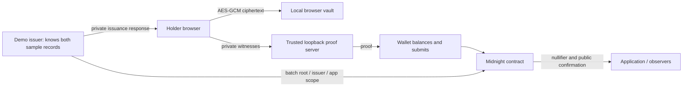

# Privacy model and limits

## Data flow

## Who knows what?

| Party | Knowledge |
|---|---|
| Issuer | All sample fields, credential secret, commitments and batch mapping |
| Holder | Selected credential, secret, sibling path, public root and app scope |
| Browser frontend | Plaintext while unlocked; can exfiltrate it if malicious |
| Local prover | Witness material needed to generate the proof |
| Wallet | Proven transaction and wallet/fee metadata; not the original issuer JSON |
| Verifier | Approved issuer, policy, batch root, scope, accepted nullifier, public transaction metadata |
| External observer | Public chain data, timing and potential correlations |

## Storage and transmission

Private issuer files reside under `.private/` with restrictive permissions and Git exclusions. Delivery is a same-origin POST body selecting a sample; private fields are returned with `Cache-Control: no-store`. URLs never include credentials. Development is bound to loopback; non-local deployment requires HTTPS.

The holder vault is encrypted in localStorage. The passphrase is not stored. While active, plaintext is present in memory, as required by witnesses. Locking drops application references; JavaScript cannot guarantee immediate secure memory erasure. A compromised browser, XSS, extension, OS or frontend can read plaintext or the passphrase. Offline guessing resistance depends on passphrase strength.

The only proof provider allowed by the frontend is loopback. This does not prevent a malicious local process from reading secrets. Do not substitute an untrusted hosted prover. No application analytics or raw SDK transaction/error logging is installed.

## What the circuit reveals

The public ledger has exactly `credentialRoot`, `approvedIssuer`, `applicationId`, and `authorizations`. The `authorize` circuit has private witnesses and discloses only its nullifier. Constructor inputs are public. Credential fields and Merkle path are hashed/constrained privately. Hashes have a random secret in the committed record to avoid a simple dictionary attack on low-entropy attributes.

A nullifier is stable for the same secret and app scope. It prevents a second authorization; it is not a general anti-tracking solution or an authorization token for a specific web session. Credential sharing is possible. Neither identity nor exclusive ownership is established.

## Evidence and its limits

Compiled-contract tests inspect exposed ledger fields and reject tampering. The real local network test proves and submits a valid authorization, queries its ledger, rejects invalid/repeated calls, and scans the finalized transaction serialization for known private strings and the full secret. Evidence contains only public IDs and assertion outcomes.

This is stronger than naming a variable “private,” but it is not a formal or comprehensive privacy audit. Absence of literal text cannot exclude alternative encodings or metadata leaks. A two-byte graduation year can occur accidentally in arbitrary binary data, so its confidentiality relies on the circuit's witness/disclosure boundary and proof system, not a substring scan.

The two public demo scenarios make attribute inference possible: everyone knows the eligible sample is 2024. Do not confuse hidden witness bytes with an anonymity guarantee. The issuer can correlate its own samples with observed authorizations. Larger independent issuance and privacy analysis are future work.
